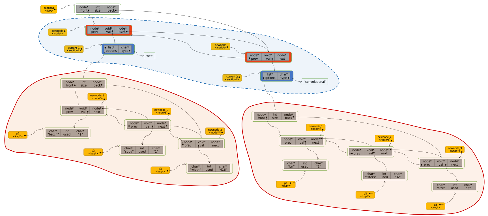
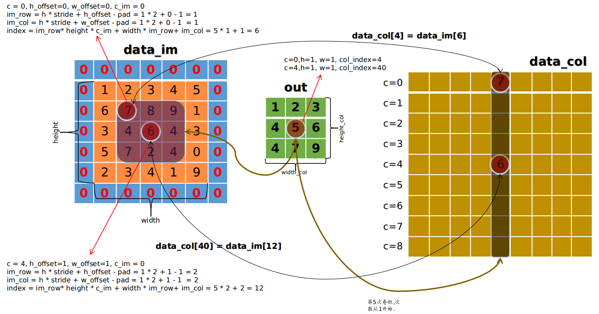

### 说明

​		2019年就萌生一个想法，想深入研究一个深度学习框架，从code上将这个黑盒子的神秘面纱揭开，后续由于工作太忙，没有太多精力投入，从2020年8月份开始，诸多工作接近尾声，开始想投入一段时间研究一个底层框架。对比了多个框架，发现darknet是一个较为轻型的完全基于C与CUDA的开源深度学习框架，没有任何依赖项（OpenCV都可以不用），移植性非常好，支持CPU与GPU两种计算方式。真正可以对神经网络的组件一探究竟，是提高自己对深度学习有效范本。

​		本人对darknet的解读，为期接近3个月时间，从2020年8月5日到至今(10月23日)，期间几乎查遍了CSDN，知乎，github所有能看到关于darknet的解读资源，这里特别感谢github上:

1. https://github.com/hgpvision/darknet
2.  https://github.com/BBuf/Darknet

​		期间也和他们私底下有过诸多交流。此外，也感谢那些微信上的联系人，经过他们的交流，使得让我疑惑的很多问题逐渐变得清晰起来。

​		由于darknet代码整个工程量还是很大的，后期，为了方便朋友们快速简单了解darknet整个框架思想，我写了一个darknet-mini版本，整个代码只实现了所有和分类网络相关的train部分。一律去除了其他seg，det，rnn，lstm等部分。代码见：https://github.com/ChenCVer/darknet-mini

​		很多朋友希望我也能出一个darknet的解读系列，后来我想了想，我的很多解读其实都放在代码中了（后期我会出一个详尽的解读系列，发表在微信公众号：**机器学习算法工程师**），在代码中有详尽的解析。对于一些特别需要用画图的形式才能说明的，我也画了图，比如，darknet关于配置解读这块，最终形成的数据结构如下(该图片的ppt格式文件在files文件夹下的code_analysis_files的1.cfg analysis中)：

再比如关于img2col也画了详细的说明图如下(该图片的ppt格式文件放在files文件夹下的code_analysis_files的2.im2col中，为了方便朋友们能debug中间过程，我也同时写了im2col对应的pyhton代码，放在同一个文件夹下)：

关于darknet的数据加载机制，由于在整个代码中要想清晰知道data的load过程已经最终将各个线程的数据拼装在一个内存空间中，我也单独将这一部分代码从整个工程代码中抽取出来，并用随机数模拟这个过程。代码可以直接运行查看（代码放在：files/code_analysis_files/4.data load analysis）。

### 后续

​		由于本人能力有限，代码中有地方可能解读不准确的地方，希望朋友们如果有任何问题，可以及时和我联系，我的微信是: **chenxunjiao1991**，qq：**576905077**，本人也希望能与各位交流，共同成长，加我时请备注：darknet。

注意：本代码从AB大神的github clone的日期是2020年8月5日，代码的编译与AB大神的方法一样，如果你想一步一步调试查看中间过程，可以用CLion  IDE进行代码分析。

### Darknet序列解读
#### 1. 

